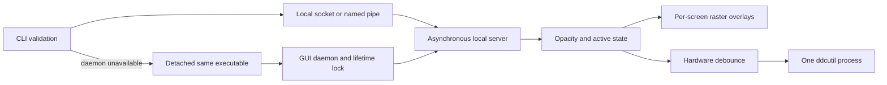

# Architecture, development, and validation

## Source layout

| File | Responsibility |
| --- | --- |
| `src/main.cpp` | CLI validation, client transport, executable discovery, detached startup, and daemon application lifecycle. |
| `src/Command.h` | Shared strict numeric validation and command whitespace trimming. |
| `src/IpcConfig.h` | User/instance endpoint naming and private Unix runtime directory validation. |
| `src/Daemon.*` | Lifetime lock, asynchronous local server, screen ownership, state changes, and hardware process scheduling. |
| `src/OverlayWindow.*` | Transparent raster windows, per-screen geometry, layer-shell integration, and cached rendered alpha. |
| `src/MacPlatform.*` | Objective-C++ AppKit window and application configuration, compiled only on Apple platforms. |
| `tests/ipc_smoke.cpp` | Native Qt socket/pipe smoke test usable on Linux, Windows, and macOS. |
| `tests/test_regression.py` | Unix adversarial IPC/lifecycle tests plus CLI and installer checks. |
| `install.py`, `install.sh`, `install.bat` | Shared installer and platform entry points. |
| `benchmark.py` | Isolated Linux offscreen IPC and memory measurements. |
| `.github/workflows/build.yml` | Native build, test, install, relocate, and package jobs. |

The client validates arguments before attempting startup. Unix control commands use native local sockets without a Qt application; Windows clients construct `QCoreApplication` for named pipes. The daemon constructs `QGuiApplication` and manages one `QRasterWindow` per `QScreen *`.



## Ownership and screen lifecycle

Overlays are owned by the daemon's screen map. Duplicate registration of the same `QScreen *` is ignored; distinct screens with identical names remain distinct. Screen removal deletes the corresponding overlay, and geometry-change signals update the window bounds. Daemon shutdown deletes all remaining overlays.

The daemon disables quit-on-last-window-close, so zero visible overlays or removing the last screen does not terminate IPC. Effective opacity 0 hides windows. Visible opacity changes only request a paint when their rounded 8-bit alpha changes.

Qt owns accepted client sockets and their deadline timers. Completed/disconnected sockets are deleted through the event loop. Reads never block the GUI event loop. The daemon limits simultaneous clients to 32 and each read buffer to 257 bytes so an oversized 256-byte frame can be detected without unbounded allocation.

## IPC endpoint and locking

On Unix, the default endpoint is `reduce-white-ipc.sock` inside a checked `$XDG_RUNTIME_DIR`. It must be an absolute directory owned by the effective user, with no group/other permissions, and must not itself be a symlink. If unusable or too long for the native socket address, the fallback is a checked directory `/tmp/reduce-white-<UID>` created with mode 0700.

The socket uses Qt user access restrictions. Parent-directory privacy also protects Unix platforms where socket permission bits alone are not sufficient. An instance name contributes a short hash to the socket filename. Windows hashes the user profile path into a pipe name and adds the optional instance suffix.

A `QLockFile` protects the endpoint for the daemon's whole lifetime. Time-based stale-lock stealing is disabled; dead-process recovery remains available. Only the lock owner removes a stale socket. An existing non-socket file or unexpected socket owner causes startup failure. The server closes before the lock is released.

## Wire protocol

Each connection carries one newline-terminated request and receives a newline-terminated response. The maximum request length is 256 bytes including the terminator. Clients that never complete a frame expire after two seconds. The CLI uses a one-second connected-request deadline.

| Request | Successful reply |
| --- | --- |
| `ping\n` | `pong\n` |
| `get\n` or `status\n` | `opacity: 0.30 active: 1\n` |
| `set 0.3\n` | `ok\n` |
| `toggle\n` | `ok\n` |
| `increase\n` or `increase 0.05\n` | `ok\n` |
| `decrease\n` or `decrease 0.05\n` | `ok\n` |
| `quit\n` | `ok\n`, then clean shutdown. |

Invalid commands receive an `error:` response without changing opacity or active state. Numeric arguments must parse completely and be finite. The parser uses floating-point `std::from_chars` when the compiler supplies it; CMake probes the overload rather than assuming it is implemented by every C++17 library. Otherwise it uses Qt's C locale with group separators rejected.

The transport handles fragmented requests and partial client I/O. A connection is not a transaction replay channel: after a connected request fails, the CLI returns failure and does not retry the state change. There is no persistent command history or exactly-once delivery guarantee after a process/connection crash.

## Hardware scheduling

The 150 ms single-shot timer coalesces rapid user commands. A target waiting while `ddcutil` is running remains pending, and the process-finished handler schedules the latest target. Successful exit records the applied brightness; failure does not update that cache. A five-second timer kills a hung process. Shutdown kills an owned in-flight hardware process rather than leaving a detached worker behind.

The regression shim records start/end events and sleeps to expose overlapping process execution. It verifies ordering and last-target selection. Real monitor behavior still needs hardware validation.

## Build configuration

| CMake option | Default | Meaning |
| --- | --- | --- |
| `CMAKE_BUILD_TYPE` | Generator dependent | Use `Release` for a single-configuration generator. |
| `BUILD_TESTING` | ON | Build the native smoke target and register available Python checks. |
| `REDUCE_WHITE_ENABLE_IPO` | ON | Enable supported LTO for Release and RelWithDebInfo targets. |
| `REDUCE_WHITE_DEPLOY_RUNTIME` | ON on Windows/macOS, OFF on Linux | Deploy Qt/runtime dependencies during installation. |
| `REDUCE_WHITE_FORCE_QT_NUMBER_PARSER` | OFF | Force the parser fallback for cross-platform verification. |
| `CMAKE_DISABLE_FIND_PACKAGE_LayerShellQt` | OFF | Set ON to exercise a build without layer-shell. |
| `CMAKE_PREFIX_PATH` | Environment/toolchain dependent | Locate the selected Qt kit. |
| `CMAKE_INSTALL_PREFIX` | CMake default | Root installation directory; installers set a local prefix explicitly. |
| `CMAKE_OSX_ARCHITECTURES` | Toolchain default | macOS CPU architecture(s); must match available Qt libraries. |

Linux portable deployment needs `patchelf` to add/adjust plugin RPATHs, including distribution plugins with no original RPATH. Keep system-Qt and portable builds in separate directories. Portable archives should be staged into a dedicated fresh prefix rather than a shared system library directory.

## Automated testing

```bash
cmake -S . -B build -DCMAKE_BUILD_TYPE=Release
cmake --build build --config Release --parallel
ctest --test-dir build -C Release --output-on-failure
```

The native test starts a private offscreen daemon, communicates using Qt local sockets/pipes, checks state and invalid input, rejects a duplicate daemon, verifies shutdown, and exercises auto-start. The Python suite tests numeric syntax, malformed wire commands, idle/disconnected clients, fragmented/oversized frames, concurrent clients and starts, crash recovery, socket/lock cleanup, unexpected file preservation, hardware scheduling, and installer failure/configuration handling. Raw Unix socket tests are skipped on Windows; the native test covers the Windows transport.

Force the macOS-compatible parser fallback and remove layer-shell from the build:

```bash
cmake -S . -B build-fallback -DCMAKE_BUILD_TYPE=Release \
  -DREDUCE_WHITE_FORCE_QT_NUMBER_PARSER=ON \
  -DCMAKE_DISABLE_FIND_PACKAGE_LayerShellQt=ON
cmake --build build-fallback --parallel
ctest --test-dir build-fallback --output-on-failure
```

For GCC/Clang diagnostics on Unix:

```bash
cmake -S . -B build-sanitize -DCMAKE_BUILD_TYPE=Debug \
  -DREDUCE_WHITE_ENABLE_IPO=OFF -DREDUCE_WHITE_DEPLOY_RUNTIME=OFF \
  '-DCMAKE_CXX_FLAGS=-fsanitize=address,undefined -fno-omit-frame-pointer'
cmake --build build-sanitize --parallel
ctest --test-dir build-sanitize --output-on-failure
```

Socket tests require local socket access. LeakSanitizer requires process inspection and may fail under ptrace/sandboxing. Such environmental failures are distinct from assertion failures or reported memory errors.

The CI native matrix uses Linux, Windows, and macOS to build, run tests, deploy runtime dependencies, move the installation, smoke-test the moved executable, and produce archives. Separate Linux jobs check a distribution Qt/LayerShellQt combination and the parser fallback. Newly added CI must actually run before its results can be claimed.

## Desktop validation

Perform these checks on each target desktop after automated tests pass:

1. Set 0.2 opacity and verify coverage on every screen, including mixed DPI/scaling configurations.
2. Click and type through the overlay into an application; ensure the overlay never takes focus.
3. Toggle off/on and confirm the stored opacity returns without stealing focus.
4. Change resolution, rotation, scaling, and screen arrangement; unplug/replug a screen.
5. Remove all external screens and verify `--status` still responds.
6. Test normal and fullscreen applications, desktop switching, and macOS Spaces/Mission Control as applicable.
7. Stop with `--quit`; ensure the command can start a fresh daemon afterward.
8. If enabling DDC/CI, test a real supported display while observing foreground daemon diagnostics.
9. Move a deployed installation and repeat startup/click-through checks without the original Qt development environment in PATH.

## Benchmarking

```bash
python3 benchmark.py --binary build/reduce-white --iterations 1000
```

This Linux-only benchmark owns a temporary offscreen daemon and never searches for or modifies an existing desktop daemon. It measures complete process invocation plus IPC separately from direct socket IPC, using a monotonic performance clock. RSS, PSS, and private memory are read from `/proc/<pid>/smaps_rollup` when permitted. Errors do not become invented zero-memory readings, and failed command invocations abort the benchmark.

Offscreen measurements exclude real compositor/rendering work. Compare runs on the same machine, Qt build, and system load. A small before/after memory delta over a finite run is not proof of leak freedom. Current measurements and review findings are recorded in [the project review](project_analysis_and_optimizations.md).
